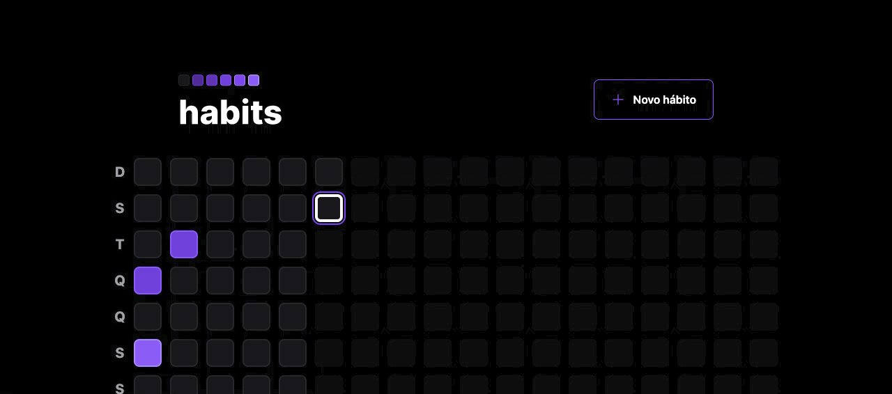
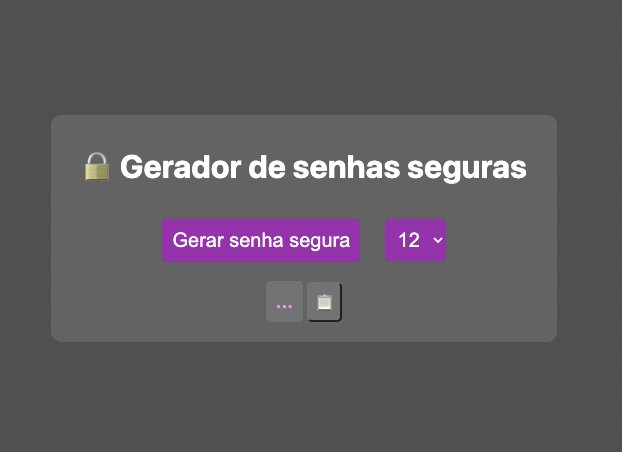
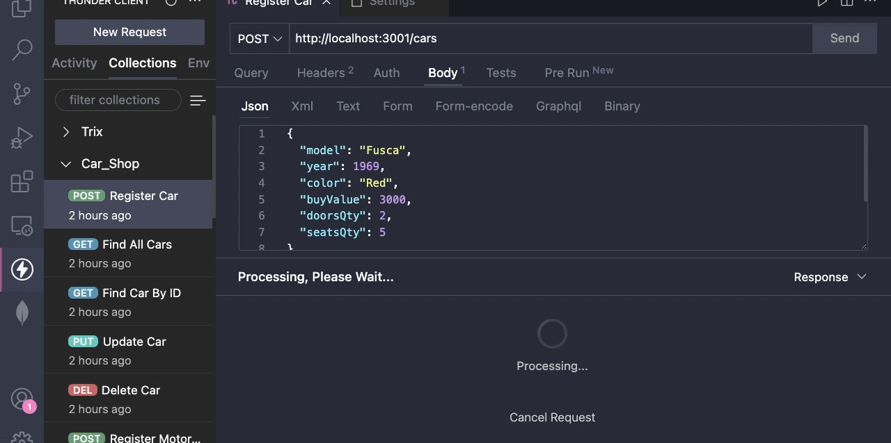
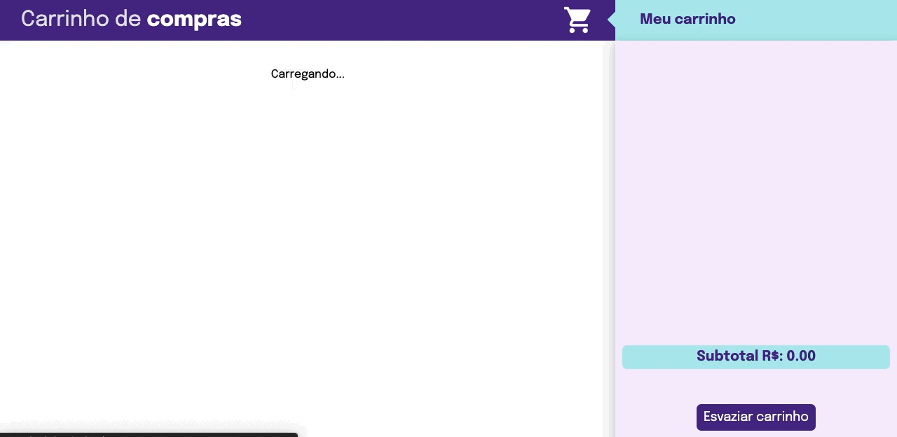
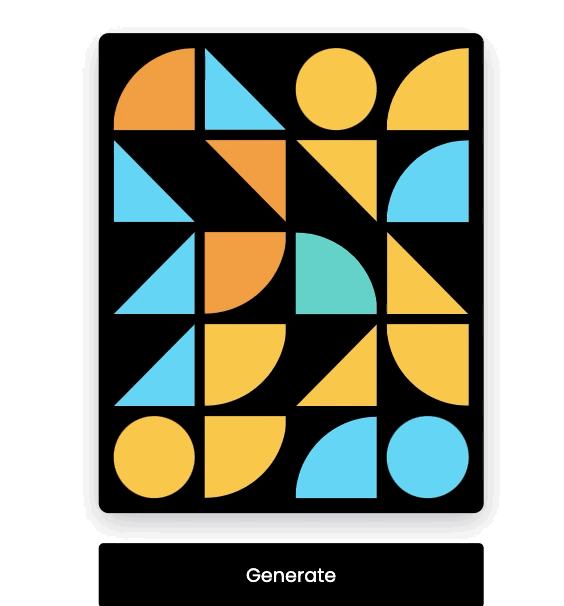
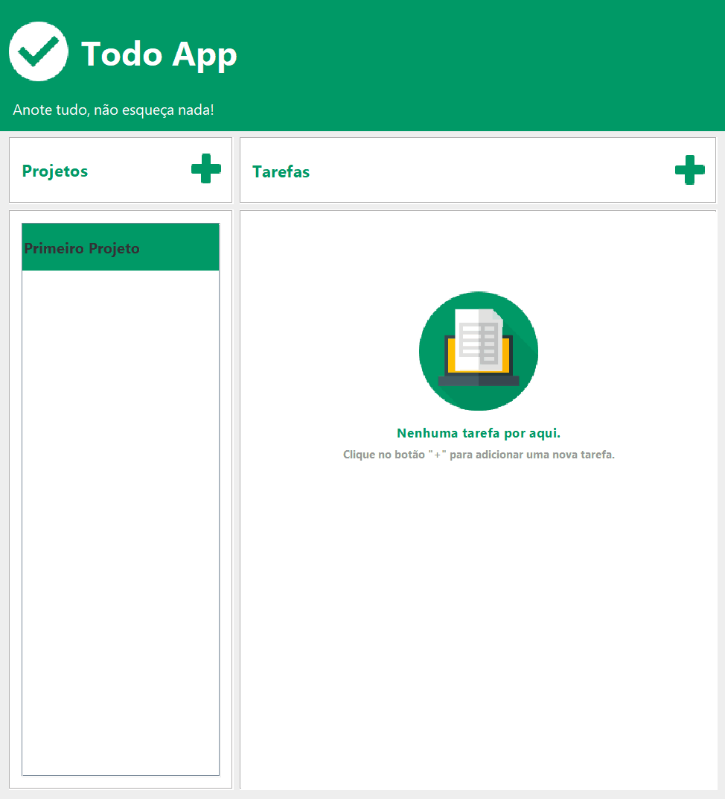

## <picture></picture> Olá!  Me chamo **Matheus Muniz**

 

Sou de São Paulo, Brasil e atualmente estudo **Desenvolvimento Web na Trybe** 🚀.

 

  

**Meus interesses pessoais:**
- 👨‍💻 Estou estudando **Orientação a objetos** para poder escrever códigos melhores e mais reutilizáveis;
- 👨‍🎓 Estou aprendendo como aplicar tipagem nos meus códigos com **TypeScript** ; 
- 🧗 Meus hobbies são 🎧 produção musical, 🎻 tocar violino e 🎲 jogos de tabuleiro;
- 💼 Busco oportunidades para evoluir na minha carreira de desenvolvedor;
- 📫 Por favor, envie um email para **matheusmml@gmail.com** para me encontrar;
- 💬 Pergunte-me qualquer coisa, adoro ajudar pessoas! 💙
<!-- - 📝 Veja meu Curriculum Vitae <a href="https://gitconnected.com/johnatas-henrique/resume" target="_blank">clicando aqui</a> para mais informações. -->

 
 

## <b> Skills</b>

-  💻 Linguagens:

    
    
    
    
    
    

- 📚 Frameworks:

   
   
   
   
   
   

- 🧪 Testes:
                                                                                                                                
  
  
  
  
                                                                                                                                
- 💽 Banco de Dados:

  
  
                                                                                                                                               
- 🔧 Ferramentas:
  
  
  
  
  
  
  

                                                                                                                                

## <b>Alguns dos meus projetos:</b>

<table>
  <tr> 
     <td>
      <h3>Super Trunfo Card Game</h3>
      

        <a href="https://frontend-super-trunfo.vercel.app/">Site</a>,
        <a href="https://github.com/mathlaza/frontend-Super-Trunfo">Repo</a>
      

      
HTML, CSS, React

      
    </td>
    <td valign="top">
      <h3>Trybe Futebol Clube</h3>
      

        <a href="https://abashed-books-production.up.railway.app/">Site</a>,
        <a href="https://github.com/mathlaza/backEnd-Trybe-Futebol-Clube">Repo</a>
      

      
Typescript, Express, Sequelize

      
    </td>
    <td valign="top">
      <h3>Habits Control</h3>
      

        <a href="https://rock-seat-nlw-habits-app.vercel.app/">Site</a>,
        <a href="https://github.com/mathlaza/RockSeat_NLW_Habits_App">Repo</a>
      

      
Node, Typescript, React Native

      
    </td>
  </tr>
  <tr> 
     <td valign="top">
      <h3>Calculator</h3>
      

        <a href="https://calculadora-delta-two.vercel.app/">Site</a>,
        <a href="https://github.com/mathlaza/calculadora">Repo</a>
      

      
HTML, CSS, Javascript

      
    </td>
    <td valign="top">
      <h3>Password Generator</h3>
      

        <a href="https://gerador-senhas-nine.vercel.app/">Site</a>,
        <a href="https://github.com/mathlaza/Gerador_Senhas">Repo</a>
      

      
Vite, ESLint, Nano ID

      
    </td>
    <td valign="top">
      <h3>Currency Exchange</h3>
      

        <a href="https://currency-exchange-tau-ten.vercel.app/">Site</a>,
        <a href="https://github.com/mathlaza/Currency_Exchange">Repo</a>
      

      
Vite, Typescript, CSS

      
    </td>
  </tr>
  <tr> 
    <td valign="top">
      <h3>Car Shop API</h3>
      

        <a href="https://github.com/mathlaza/backend-Car-Shop">Repo</a>
      

      
Mongoose, Typescript, Mocha

      
    </td>
    <td>
      <h3>Shopping Cart</h3>
      

        <a href="https://frontend-shopping-cart-ruby.vercel.app/">Site</a>,
        <a href="https://github.com/mathlaza/frontend-Shopping-Cart">Repo</a>
      

      
Javascript, CSS, Jest

      
    </td>
    <td>
      <h3>Solar System</h3>
      

        <a href="https://frontend-solar-system.vercel.app/">Site</a>,
        <a href="https://github.com/mathlaza/frontend-Solar-System">Repo</a>
      

      
React, CSS

      
    </td>
  </tr>
  <tr>
    <td>
      <h3>Geometric Generator</h3>
      

        <a href="https://geometric-generator.vercel.app/">Site</a>,
        <a href="https://github.com/mathlaza/geometric-generator">Repo</a>
      

      
HTML, CSS, Javascript

      
    </td>
    <td>
      <h3>TodoApp</h3>
      

        <a href="https://github.com/mathlaza/JavaTodoApp">Repo</a>
      

      
Java, phpMyAdmin, NetBeans

      
    </td>
  </tr>
</table>

 

## 
  

   
   
  

   

## <b> Conecte-se comigo!</b>

