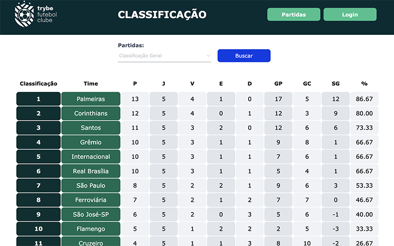
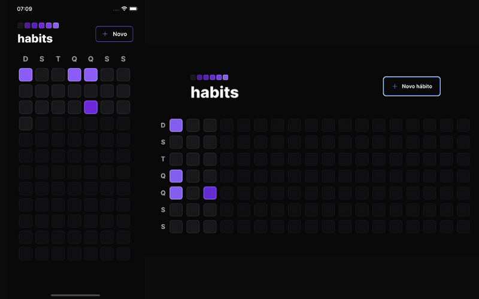
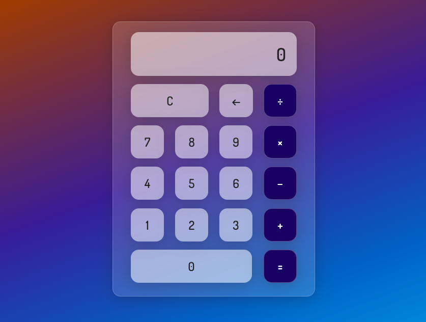

## <picture></picture> Olá!  Me chamo **Matheus Martinez**

 

Sou de São Paulo, Brasil e atualmente estudo **Desenvolvimento Web na Trybe** 🚀.

 

  

**Meus interesses pessoais:**
- 👨‍💻 Estou estudando **Orientação a objetos** para poder escrever códigos melhores e mais reutilizáveis;
- 👨‍🎓 Estou aprendendo como fazer testes de integração nas minhas próprias **API**; 
- 🧗 Meus hobbies são produção musical 🎻 e jogos online 🎮;
- 💼 Busco sempre oportunidades para evoluir na minha carreira de desenvolvedor;
- 📫 Por favor, envie um email para **matheusmml@gmail.com** para me encontrar;
- 💬 Pergunte-me qualquer coisa, adoro ajudar pessoas! 💙
<!-- - 📝 Veja meu Curriculum Vitae <a href="https://gitconnected.com/johnatas-henrique/resume" target="_blank">clicando aqui</a> para mais informações. -->

 
 

## <b> Skills</b>
<!-- 

   
   
   
   
  
   
  
   
  
  
  
  

 -->

 
  

    
     
     
     
    
    
    
    
  

  

      
    
    
    
     
<!--      -->
  
 

 

   
  
  

 

## <b>Alguns dos meus projetos:</b>

<table>
  <tr> 
    <td valign="top">
      <h3 align="center">Trybe Futebol Clube</h3>
      

        <a href="https://blessed-trousers-production.up.railway.app/">Site</a>,
        <a href="https://github.com/mathlaza/backEnd-Trybe-Futebol-Clube">Repo</a>
      

      
Typescript, Express, Sequelize

      
    </td>
    
    <td valign="top">
      <h3 align="center">Habits Control</h3>
      

        <a href="https://github.com/mathlaza/RockSeat_NLW_Habits_App">Repo</a>
      

      
Node, Typescript, React Native

      
    </td>
    
    <td valign="top">
      <h3 align="center">Habits Control</h3>
      

        <a href="https://calculadora-delta-two.vercel.app/">Site</a>,
        <a href="https://github.com/mathlaza/calculadora">Repo</a>
      

      
Node, Typescript, React Native

      
    </td>
  </tr>
</table>

 
<!--   -->

## <b> Conecte-se comigo!</b>

